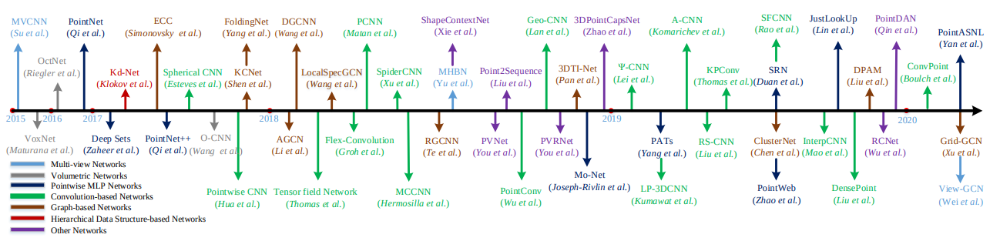
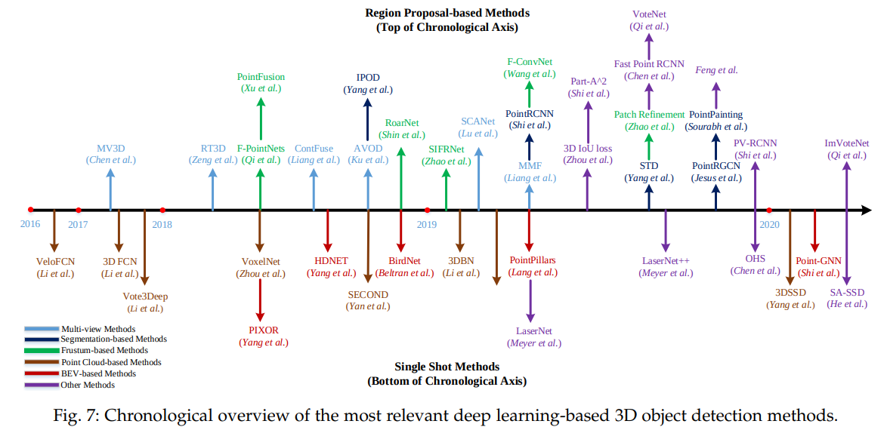
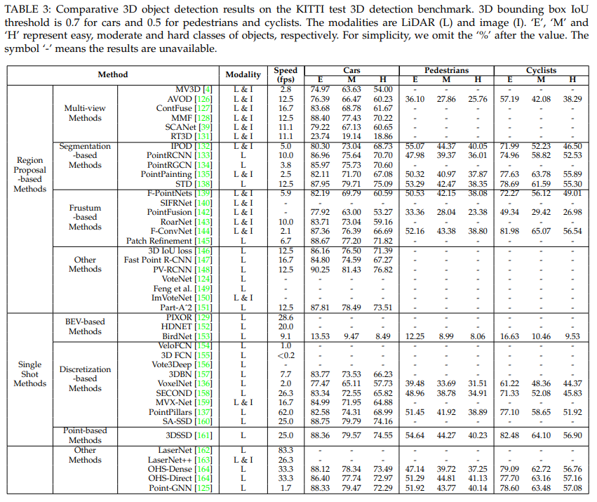
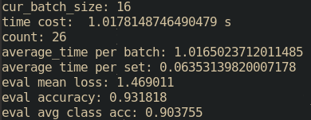

- [3D Point Cloud](#3d-point-cloud)
  - [3D shape classification](#3d-shape-classification)
  - [3D object detection and tracking](#3d-object-detection-and-tracking)
    - [1. Region Proposal-based : 提出几个可能的包含对象的区域，然后提取区域特征以确定每个提议的类别标签。](#1-region-proposal-based--提出几个可能的包含对象的区域然后提取区域特征以确定每个提议的类别标签)
      - [multi-view based: 慢](#multi-view-based-慢)
      - [segmentation-based：STD（F）/PointPainting/PointRGCN](#segmentation-basedstdfpointpaintingpointrgcn)
      - [frustum-based : F-ConvNet](#frustum-based--f-convnet)
    - [2. Single Shot Methods :](#2-single-shot-methods-)
      - [BEV-based](#bev-based)
      - [Discretization-based : 3DBN/SA-SSD/](#discretization-based--3dbnsa-ssd)
      - [Point-based Methods : 3DSSD](#point-based-methods--3dssd)
      - [other ： LaserNet/Lasernet++](#other--lasernetlasernet)
  - [3D point cloud segmentation](#3d-point-cloud-segmentation)
  - [Grid-GCNN](#grid-gcnn)
  - [LDG CNN](#ldg-cnn)
  - [PointWeb](#pointweb)
  - [pointconv](#pointconv)
  - [PAConv](#paconv)
  - [PointView-GCN](#pointview-gcn)

# 3D Point Cloud

 3D shape classification
 3D object detection and tracking
 3D point cloud segmentation
 
 

 ## 3D shape classification

PointNet

##  3D object detection and tracking

### 1. Region Proposal-based : 提出几个可能的包含对象的区域，然后提取区域特征以确定每个提议的类别标签。
        
#### multi-view based: 慢
- 从 BEV 图生成一组高度准确的 3D 候选框，并将它们投影到多个视图的特征图（例如，LiDAR 前视图图像、RGB 图像）。然后他们结合来自不同视图的这些区域特征来预测定向的 3D 边界框.  

- RT3D使用了预 RoI 池化卷积来提高MV3D 的效率。具体来说，他们将大部分卷积操作移到了 RoI 池化模块之前。因此，对所有对象建议执行一次 RoI 卷积。实验结果表明，该方法可以以 11.1 fps 的速度运行，比 MV3D 快 5 倍。

#### segmentation-based：STD（F）/PointPainting/PointRGCN
- 语义分割技术去除大部分背景点，在前景点上生成大量高质量的提议以节省计算量，如图 8(b) 所示。与multi-view based相比，这些方法实现了更高的对象召回率，更适用于具有高度遮挡和拥挤对象的复杂场景。
#### frustum-based : F-ConvNet
- leverage existing 2D object detectors to generate 2D candidate regions of objects and then extract a 3D frustum proposal for each 2D candidate region. 受到 2D object detectors的限制。

### 2. Single Shot Methods : 
- directly predict class probabilities and regress 3D bounding boxes of objects using a single-stage network. They do not need region proposal generation and post-processing.
- fast
#### BEV-based

#### Discretization-based : 3DBN/SA-SSD/
-  convert a point cloud into a regular discrete representation, and then apply CNN to predict both categories and 3D boxes of objects.

#### Point-based Methods : 3DSSD
- 直接以原始点云为输入

#### other ： LaserNet/Lasernet++

## 3D point cloud segmentation

--------------------------------------------------------------------
## Grid-GCNN

## LDG CNN

## PointWeb
- detection
- acc not good

## pointconv
1000 points<9.9ms

## PAConv
batch size = 16 
0.118s / batch
7ms / 1w points
acc : 0.935981

## PointView-GCN
