- [1. data format](#1-data-format)
  - [dataset (shujutang):](#dataset-shujutang)
  - [our\_data](#our_data)
- [2. Experiment on our\_data](#2-experiment-on-our_data)
  - [PAConv](#paconv)
    - [1. train:](#1-train)
    - [2. test:](#2-test)
    - [3. .t7 to .onnx](#3-t7-to-onnx)
  - [DGCNN](#dgcnn)
    - [Train \& Test：](#train--test)
    - [pytorch -\> onnx:](#pytorch---onnx)
    - [onnx → ncnn](#onnx--ncnn)
    - [Q \& A](#q--a)
    - [ncnn model](#ncnn-model)
    - [Results](#results)
  - [PointHop++](#pointhop)
  - [View-GCN](#view-gcn)
  - [squeezent](#squeezent)
    - [Q \& A：](#q--a-1)
- [PCD → 二维 → 轮廓图像 ？](#pcd--二维--轮廓图像-)
  - [open3d](#open3d)


# 1. data format
## dataset (shujutang):

- label(1 * 12): 

            - 00000.txt:

              obj_id  truncation  occlusion  abnormal  rotation_y  heading  cen.x  cen.y  cen.z  l  w  h  

- velodyne: 
 
              - 00000.bin:   loc.x  loc.y  loc.z  intensity

lenet

res net 18

mobile net 123

## our_data

- pcd_data_train*.hdf5(3 * 600)

          - label:

           0(ped)  1(bike)  2(car)

         - data:         ped_*.pcd  bike_*.pcd  car_*.pcd

- pcd_data_test*.hdf5(3 * 400)

          - label:

           0(ped)  1(bike)  2(car)

         - data:         ped_*.pcd  bike_*.pcd  car_*.pcd

# 2. Experiment on our_data
## PAConv

- modelnet40 1024points * 20

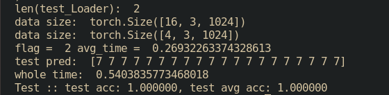


- inno 10000 points * 30


- inno 5000 points * 30

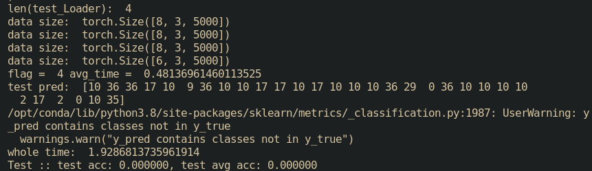


- inno 1024 points * 30


> 训练集中模型形状完整，无truck分类，制作训练集

### 1. train: 

    epoch:350, batch size: 16, test batch size: 8


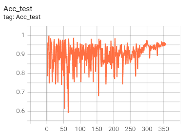


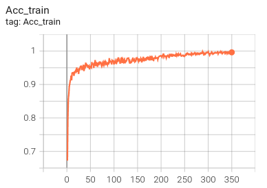


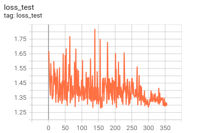


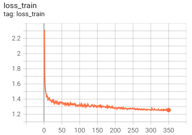


### 2. test: 

    GPU: tnum_points: 1024, test_batch_size: 16, 

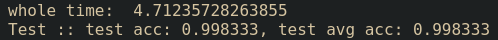


time cost per pcd(1024 points): 0.007853929 s 

    CPU: tnum_points: 1024, test_batch_size: 16, 

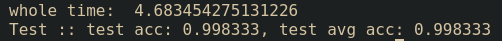


time cost per pcd(1024 points): 0.007833333 s

### 3. .t7 to .onnx


> Q1: 生成.onnx： Missing key(s) in state_dict

    RuntimeError: Error(s) in loading state_dict for PAConv: Missing key(s) in state_dict: "matrice1", "matrice2", "matrice3”……

    Unexpected key(s) in state_dict: "module.matrice1", "module.matrice2", "module.matrice3"……

原因：gpu训练网络参数保存通常是module.**.**作为键，而CPU上带匹配键是model.**.**，这时就要改过来，出现missing。

解决方法：将字典键值中的module.替换掉

```
model.load_state_dict({k.replace('module.', ''): v for k, v in torch.load(model_path).items()})
```

https://blog.csdn.net/Mr_WHITE2/article/details/108955177#:~:text=Missing%20key%20%28s%29%20in%20state_dict%20%E8%A7%A3%E5%86%B3%E6%96%B9%E6%B3%95%EF%BC%9A%20%20,name%20%3D%20%27module.%27%2Bk%20%23%20add%20%60module.%60...%20%E5%9C%A8%E8%AE%AD%E7%BB%83%E7%9A%84%E6%97%B6%E5%80%99%EF%BC%8C%E4%BD%BF%E7%94%A8%E4%BA%86%E5%8D%95%E6%9C%BA%E5%A4%9A%E5%8D%A1%EF%BC%8Cload%20%E6%A8%A1%E5%9E%8B%E7%9A%84%E6%97%B6%E5%80%99%E5%87%BA%E7%8E%B0%E4%BA%86%E9%97%AE%E9%A2%98%EF%BC%8C%E6%90%9C%E7%B4%A2%E4%B9%8B%E5%90%8E%E5%8F%91%E7%8E%B0%EF%BC%8C%E6%98%AF%E5%9B%A0%E4%B8%BA%E5%8D%95%E6%9C%BA%E5%A4%9A%E5%8D%A1%E7%9A%84%E5%8E%9F%E5%9B%A0%E3%80%82 

> Q2：ONNX export failed: Couldn't export Python operator AssignScoreWithK

不支持Custom Operator，需自行导入onnx中

https://pytorch.org/tutorials/advanced/torch_script_custom_ops.html
 

## DGCNN

### Train & Test：

> GPU: 
 
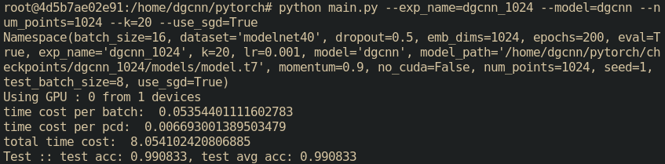


> CPU:

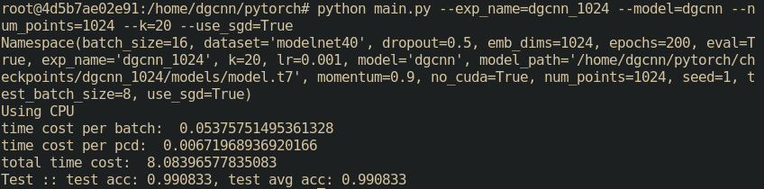


### pytorch -> onnx: 

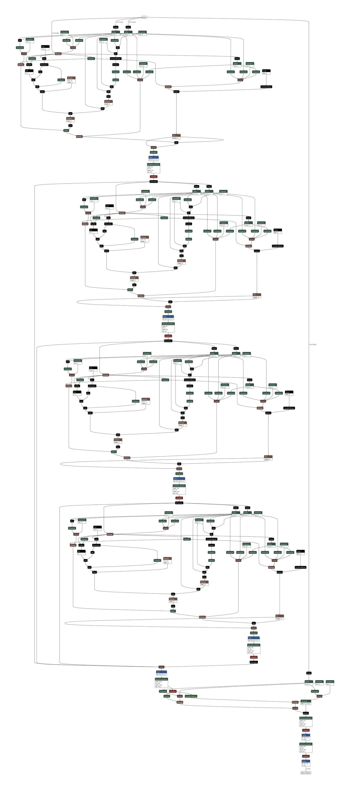


### onnx → ncnn

> ncnn模型结构： 

https://github.com/Tencent/ncnn/wiki/param-and-model-file-structure

Simplif onnx model:
```
pip install onnx-simplifier
python -m onnxsim test.onnx gdcnn_simplif.onnx
```

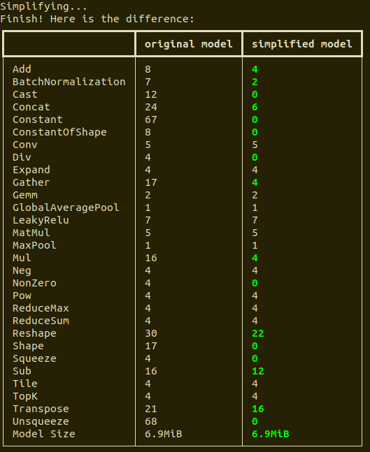


onnx-simplifier  无法完全去除
```python
TopK not supported yet!
  # axis=-1
Gather not supported yet!
  # axis=0
Expand not supported yet!
Tile not supported yet!
TopK not supported yet!
  # axis=-1
Gather not supported yet!
  # axis=0
Expand not supported yet!
Tile not supported yet!
TopK not supported yet!
  # axis=-1
Gather not supported yet!
  # axis=0
Expand not supported yet!
Tile not supported yet!
TopK not supported yet!
  # axis=-1
Gather not supported yet!
  # axis=0
Expand not supported yet!
Tile not supported yet!
```
https://github.com/Tencent/ncnn/issues/1358 

### Q & A
> Q1: 直接使用含有不完全简化的ncnn模型：layer XYZ not exists or registered

> A1：.param中直接删除不支持的层。

需要修改.param中的layer count，blobs。报错：

    param is too pld, please regenerate

> A2：将不支持op设为noop
https://github.com/Tencent/ncnn/wiki/FAQ-ncnn-throw-error

在load model前添加：
```python
class Noop : public ncnn::Layer {};
DEFINE_LAYER_CREATOR(Noop)

net.register_custom_layer("TopK", Noop_layer_creator);
net.register_custom_layer("Gather", Noop_layer_creator);
```
> A3: onnx2ncnn.cpp中将未定义op跳过

> A4：自定义op

 https://github.com/Tencent/ncnn/wiki/add-custom-layer.zh#%E5%AE%9A%E4%B9%89%E6%BA%90%E7%A0%81h%E6%96%87%E4%BB%B6srclayerrelu6h

 直接从pytorch → ncnn

 https://github.com/starimeL/PytorchConverter

pointnet无topk，重新训练

> 导出成功~


### ncnn model


### Results
> Result: 1 PCD 1024 points 

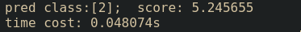


> RESULT: 1061 PCD 1024 points car
    pointnet-opt-fp16

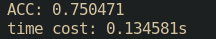


    pointnet_train_2-opt-fp16


> RESULT: 144 PCD 1024 points bike


## PointHop++
    30ms / pcd

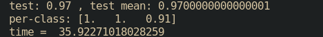


> Q1：KNN, 模型无法转化为onnx

## View-GCN
    输入：模型多视图图片（12）。能否使用pcd得到？

## squeezent

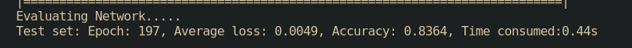


    ncnn model & onnx simplifed & innx origin

### Q & A：

- 转ncnn后测试结果不正常？TODO: 在原网络中效果？得分计算方式？

- ncnn中计时函数应选择#include <sys/time.h>

- 图片分类网络计时是否有问题？

- 重新训练点云网络128/1024，gpu/cpu准确率时间

- 转ncnn后准确率下降？

- caffe点云分类网络

# PCD → 二维 → 轮廓图像 ？
## open3d

https://github.com/isl-org/Open3D/issues/1912 

open3d 批量导出侧视图：


> 如何自动关闭窗口？DONE


