- [1. Overall Structure](#1-overall-structure)
- [2. Hand-Eye Caliration Method](#2-hand-eye-caliration-method)
- [3. Solve AX = XB](#3-solve-ax--xb)
- [4. Dual Quaternion](#4-dual-quaternion)
- [5. Related Page](#5-related-page)

# 1. Overall Structure

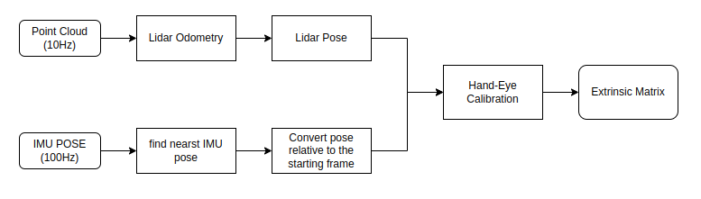

# 2. Hand-Eye Caliration Method

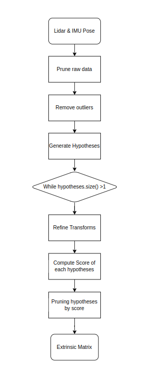

> Mainly based on hand-eye calibration method

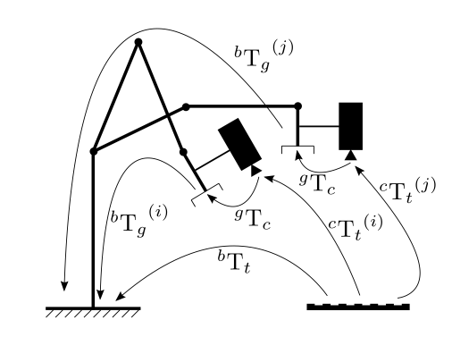

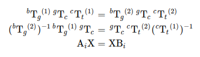

> The extrinsic matrix is from IMU axis to Lidar axis.
>
> Lidar_pose = Extrinsic * IMU_pose * Extrinsic.inverse()

# 3. Solve AX = XB

The function performs the Hand-Eye calibration using various methods. 

- [ ] One approach consists in estimating the rotation then the translation (separable solutions).

- [ ] Separable solutions solving separately damages the integrity of the kinematics problem and leads to coupling errors in the calculation of rotation and translation.

> R. Tsai, R. Lenz A New Technique for Fully Autonomous and Efficient 3D Robotics Hand/EyeCalibration
>
> F. Park, B. Martin Robot Sensor Calibration: Solving AX = XB on the Euclidean Group
> 
> R. Horaud, F. Dornaika Hand-Eye Calibration

- [ ] Another approach consists in estimating simultaneously the rotation and the translation (simultaneous solutions).

- [ ] Simultaneous solutions handle rotation and translation simultaneously and describes pose transformation in a unified manner, reducing complexity and improving calibration accuracy.

> N. Andreff, R. Horaud, B. Espiau On-line Hand-Eye Calibration
>
>K. Daniilidis Hand-Eye Calibration Using Dual Quaternions

In this program, we use K. Daniilidis's Dual Quaternions method to solve AX=XB problem.

# 4. Dual Quaternion
- dual number: 

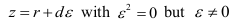

- dual quaternion:

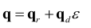

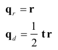

    point b to point a :

    use quaternion:  pa = q * pb * q̄

    A line in space with direction la through a point pa to a line in space with direction lb through a point pb: 

    la = q * lb * q̄

Hand-Eye Transformation with Unit Dual Quaternions:

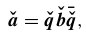

    ǎ denote the screw of a camera motion, and b̌  denote the screw of the hand motion.

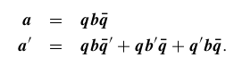

Multiplying on the right with q.

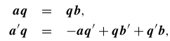

Let a = (0, a) and a' = (0, a'), as well as b = (0, b), b' = (0, b').

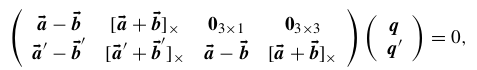

SVD: 

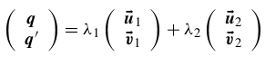

results:

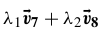

    v7, v8 is the last two right-singular vectors

- compare to two-steps method(Tsai method) and nonlinear method:

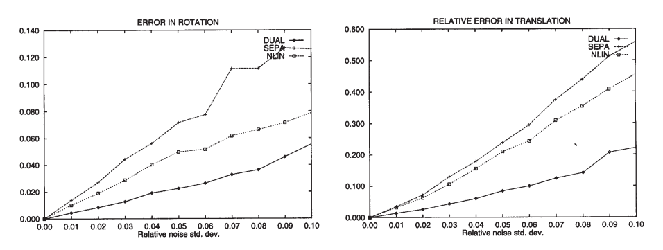

       Behavior of the dual quaternion (DUAL), the nonlinear (NLIN), and the two-step (SEPA) algorithms with variation in noise. The RMS rotation error is shown on the left; the RMS relative translation error is on the right.

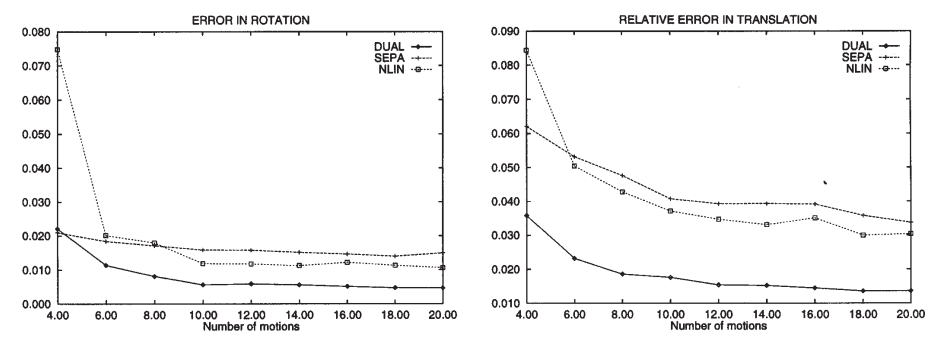

    The RMS error in rotation (left) and the RMS relative error in translation (right) as a function of the number of hand and camera motions.

# 5. Related Page

> module design
https://docs.opencv.org/4.x/d9/d0c/group__calib3d.html#gaebfc1c9f7434196a374c382abf43439b

> past calibration result
 
https://printeger.github.io/2022/08/14/Lidar-IMU-Extrinsic-Calibration-Experiment.html