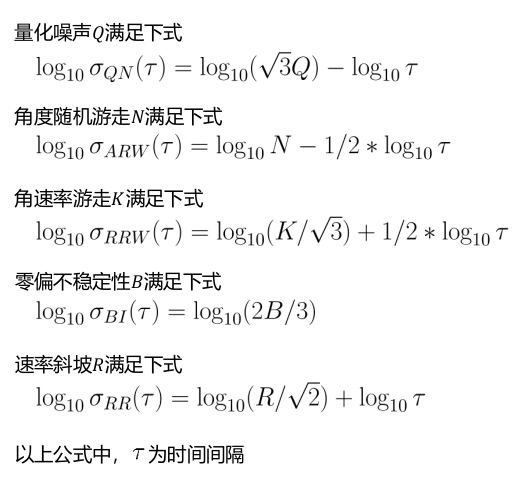
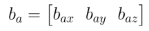
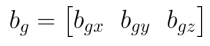
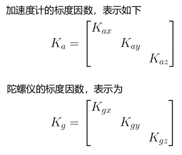
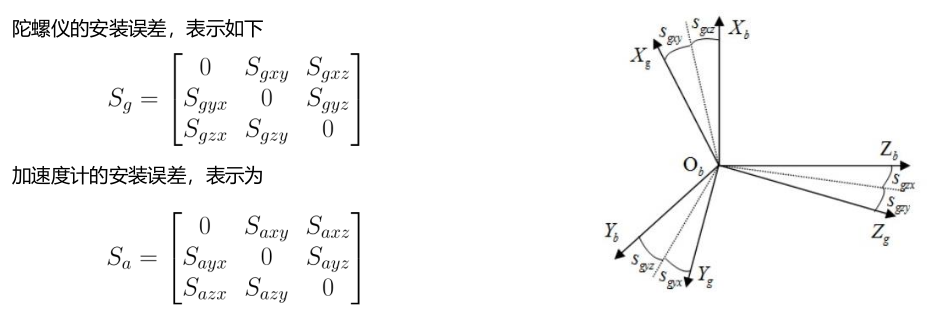
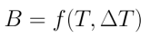
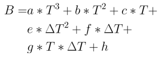

- [1. 信号误差组成](#1-信号误差组成)
  - [1) 量化噪声](#1-量化噪声)
  - [2) 角度随机游走](#2-角度随机游走)
  - [3) 角速率随机游走](#3-角速率随机游走)
  - [4) 零偏不稳定性噪声](#4-零偏不稳定性噪声)
  - [5) 速率斜坡](#5-速率斜坡)
  - [6) 零偏重复性](#6-零偏重复性)
- [2. 信号误差分析--- Allan方差](#2-信号误差分析----allan方差)
- [3. IMU内参](#3-imu内参)
  - [1）零偏误差：](#1零偏误差)
  - [2）刻度系数误差：](#2刻度系数误差)
  - [3）安装误差：](#3安装误差)
- [4. 内参标定](#4-内参标定)
  - [4.1 需要转台：](#41-需要转台)
  - [4.2 无需外部辅助：](#42-无需外部辅助)
- [5. 温度补偿](#5-温度补偿)

# 1. 信号误差组成

## 1) 量化噪声

一切量化操作所固有的噪声,是数字传感器必然出现的噪声;
产生原因: 通过AD采集把连续时间信号采集成离散信号的过程中,精度会损失,精度损失的大小和AD转换的步长
有关,步长越小,量化噪声越小。

## 2) 角度随机游走

宽带角速率白噪声:陀螺输出角速率是含噪声的,该噪声中的白噪声成分;
产生原因:计算姿态的本质是对角速率做积分,这必然会对噪声也做了积分。白噪声的积分并不是白噪声,而是一个马尔可夫过程,即当前时刻的误差是在上一时刻误差的基础上累加一个随机白噪声得到的。
角度误差中所含的马尔可夫性质的误差,称为角度随机游走。

## 3) 角速率随机游走

与角度随机游走类似,角速率误差中所含的马尔可夫性质的误差,称为角速率随机游走。而这个马尔可夫性质的误差是由宽带角加速率白噪声累积的结果。

## 4) 零偏不稳定性噪声

零偏:即常说的bias,一般不是一个固定参数,而是在一定范围内缓慢随机飘移。
零偏不稳定性:零偏随时间缓慢变化,其变化值无法预估,需要假定一个概率区间描述它有多大的可能性落在这个
区间内。时间越长,区间越大。

## 5) 速率斜坡

该误差是趋势性误差,而不是随机误差。
随机误差,是指你无法用确定性模型去拟合并消除它,最多只能用概率模型去描述它,这样得到的预测结果也是概率性质的。
趋势性误差,是可以直接拟合消除的,在陀螺里产生这种误差最常见的原因是温度引起零位变化,可以通过温补来消除。

## 6) 零偏重复性

多次启动时,零偏不相等,因此会有一个重复性误差。在实际使用中,需要每次上电都重新估计一次。
Allan方差分析时,不包含对零偏重复性的分析。

# 2. 信号误差分析--- Allan方差

在惯性器件随机误差分析中,以上提到的5种误差相互独立,且值不同,因此若绘制“时间间隔-方差双对数曲线”(时间间隔是频率的倒数,方差是功率谱的积分), 则得到的曲线斜率必不相同。
根据曲线斜率识别出各项误差,并计算出对应的误差强度。

求曲线与T=1的交点，求得Q、N、K、B、R。

使用：

角度随机游走,在融合时作为陀螺仪的噪声使用。(有时也以零偏不稳定性当做噪声)

2.角速度随机游走,作为陀螺仪微分项中的噪声

其他误差项,仅起到了解器件精度水平的作用;

实际融合时,Allan分析的结果,只是作为初值使用,需要在此基础上调参。

# 3. IMU内参

## 1）零偏误差：
陀螺仪或加速度计输出中的常值偏移,即常说的 bias。

## 2）刻度系数误差：
器件的输出往往为脉冲值或模数转换得到的值,需要乘以一个刻度系数才能转换成角速度或加速度值,若该系数不准,便存在刻度系数误差。

## 3）安装误差：
如图所示,b坐标系是正交的imu坐标系,g坐标系的三个轴是分别对应三个陀螺仪。由于加工工艺原因,陀螺仪的三个轴并不正交,而且和b坐标系的轴不重合,二者之间的偏差即为安装误差。

陀螺仪的输出:

加速度计的输出：

# 4. 内参标定

## 4.1 需要转台：
精度高,成本高

## 4.2 无需外部辅助：
精度差,成本低、效率高，对一般MEMS已足够

https://github.com/Kyle-ak/imu_tk 

    [ A  Robust  and  Easy  to  Implement  Method  for  IMU  Calibration  withoutExternal  Equipments ] 

# 5. 温度补偿

B：IMU bias, T：温度，delt_T：变温率，f：未知模型。通常：

