# 1. 运动畸变

原因：

激光点云非瞬时得到；

点云频率较低，自身运动不能忽略

## 1.1 平移带来的畸变

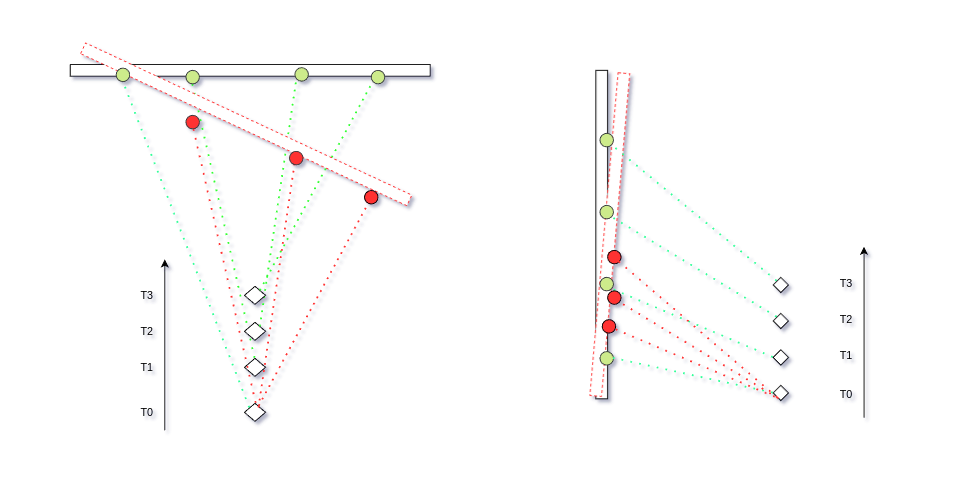


## 1.2 旋转带来的畸变

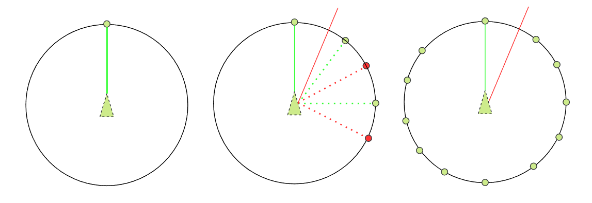


# 2. 畸变去除方法

> 总体思路：
>
> 1）获得目标运动信息，点云中各个点的2）采样时间，通过匀速运动假设。对每个点做3）变换。

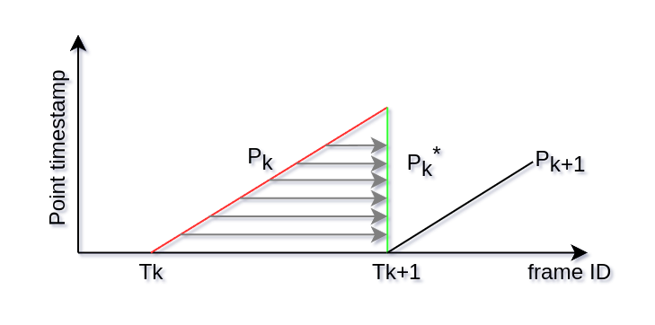


假设一帧点云中,起始时刻雷达的位姿为

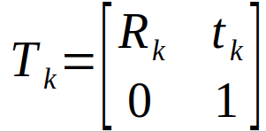


第k帧点云中第i时刻的点的位姿可以通过匀速运动假设通过插值得到：

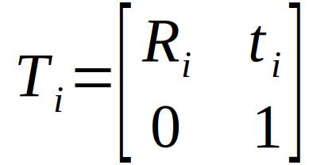


第i个激光点的坐标为:

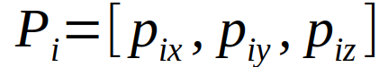


第i个激光点补偿畸变后的坐标应该为

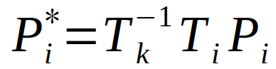


由于激光采集的点云并不是在同一时刻采集的，所以就会存在运动畸变（坐标系不同引起的），所以需要根据接收激光点的时间计算位姿把点云投影到同一坐标系。为了补偿每次扫描的时间和位姿不同，


## 2.1 基于位姿估计

ICP与VICP

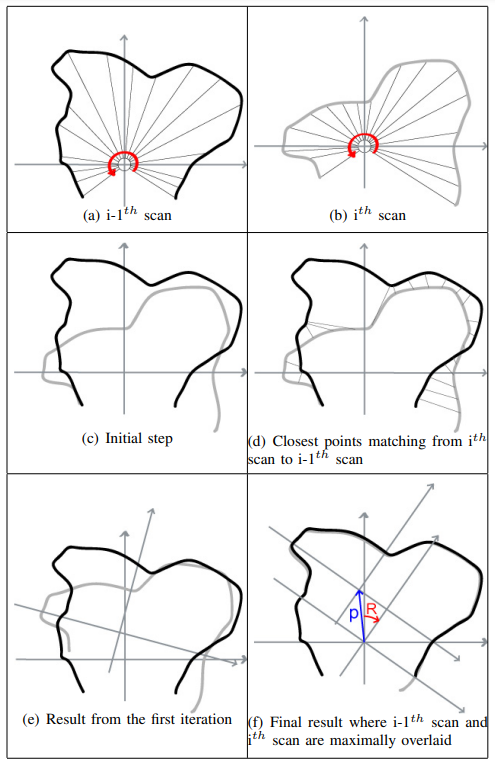


VICP


ICP依赖初值，容易陷入局部最优。


## 2.2 外接传感器


## 2.3 融合方法


# 3. 部分点云处理算法采用运动补偿方法

## 3.1 A-LOAM


## 3.2 Lego Loam

LEGO LOAM中把一帧分为6份应该也是分段线性的思想），分段线性对于多核的CPU并行运算也有好处。

## 3.3 LOAM


## 3.4 FAST LIO
```c++
/*
基于IMU预测对Lidar点云去畸变
输入：
  待补偿的第k帧点云:PC_k，
  这一帧点云时刻之前和之后最近的两帧IMU测量head & tail:
  head->rot; head->vel; head->pos; tail->acc; tail->gyr;
  Lidar坐标系到IMU坐标系的旋转与平移变换：R_LI，T_LI
*/
// 流程：
  for(point pi in PC_k)
  {
    dt = pi->timestamp - head->timestamp;  //
    // 当前待补偿点的旋转
    R_pi = head->rot * Exp(tail->gyr, dt); 
    // 点到Lidar末尾的平移变换
    T_pi = head->pos + head->vel * dt + 0.5 * tail->acc * dt * dt - imu_state.pos
    // 补偿至lidar坐标系：R_LI  * pi_c + T_LI = R_pi * (R_LI * pi + T_LI) + T_pi
    pi_compensation = R_LI.inv() * (R _I  * (R_pi * (R_LI * pi + T_LI) + T_pi) - T_LI)
  }
```
## 3.5 Livox Horizon loam

在livox_horizon_loam中，对于利用imu补偿也是这样做的。
这个代码仅仅是对旋转做了补偿，未对位移进行计算，因为位移需要有速度，但是仅仅依靠imu，长时间积分速度会很不准，需要利用反馈信息来纠正，当前没有这样做，所以仅仅是利用了旋转量。

该算法每次都累计若干个imu，对应一帧lidar数据。
为了对这一帧的lidar点进行运动补偿，需要计算出这一帧时间内，旋转了多少。
```c++
/*
输入：
    待补偿点云帧PC和起始时间与末尾时间
    这一时刻IMU测量的运动(使用李群表示)：Sophus::SE3d Tbe
*/
// 流程：
    for (point pi in PC_k)
    {
      //取出旋转和平移
      Eigen::Vector3d tbe = Tbe.translation();
      Eigen::Vector3d rso3_be = Tbe.so3().log();
      // 点在这一帧点云中所占时间比例
      double ratio_bi = dt_bi / dt_be;
      // 根据比例计算当前点的旋转和平移
      Eigen::Vector3d rso3_ie = (1-ratio_bi) * rso3_be;
      SO3d Rie = SO3d::exp(rso3_ie);
      Eigen::Vector3d tie = ratio_ie * tbe;
      // 仅使用旋转进行补偿，将点补偿至点云帧最后时刻
      P_compensate = R_ei * Pi + t_ei
      Eigen::Vector3d v_pt_comp_e = Rie.inverse() * (v_pt_i - tie);

    }
```
## 3.6 Apollo
```c++
/*
输入：
    待补偿点云帧PC，该帧点云起始时间PC_beg, 该帧点云末尾时间：PC_end
    点云起始时刻之前最近一帧IMU状态t_beg, q_beg
    点云末尾时刻之后最近一帧IMU状态t_end, q_end(平移+旋转（四元数）)。
*/
// 流程：
    Quaterniond q_0 = (0, 0, 0, 1);
    Quaterniond q_1 = q_end.inv() * q_beg;
    double theta = acos(abs(q0.dot(q1)));
    
    // 基于velodyne雷达角分辨率，转动大于该分辨率则为"significant rotation"
    double Rotation_threshold = cos(0.0003 / 2);
    // 对有significant rotation的帧同时补偿旋转和平移
    if(abs(q0.dot(q1)) > Rotation_threshold)
    {
      for (point pi in PC_k)
      {
        // 待补偿点的时间系数
        double t_s = (PC_end - pi_timestamp) / (PC_end - PC_beg);
        // 补偿平移运动
        Eigen::Translation3d t_compensated = t_s * translation;
        // 补偿旋转
        double c0 = sin((1 - t_s) * theta) / sin(theta);
        double c1 = sin(t_s * theta) / sin(theta) * c1_sign;
        Quaterniond q_compensated = c0 * q_0 + c1 * q_1;
        Eigen::Affine3d trans = t_compensated * q_compensated;
        pi_compensated = trans * pi;
      }
      // 非significant rotation的帧只补偿平移
      else 
      {
        for (point pi in PC_k)
        {
          // 待补偿点的时间系数
          double t_s = (PC_end - pi_timestamp) / (PC_end - PC_beg);
          // 补偿平移运动
          Eigen::Translation3d t_compensated = t_s * translation;
          pi_compensated = t_compensated * pi;
        }
      }
    }
```


# 4. 补偿效果对比：
> work flow

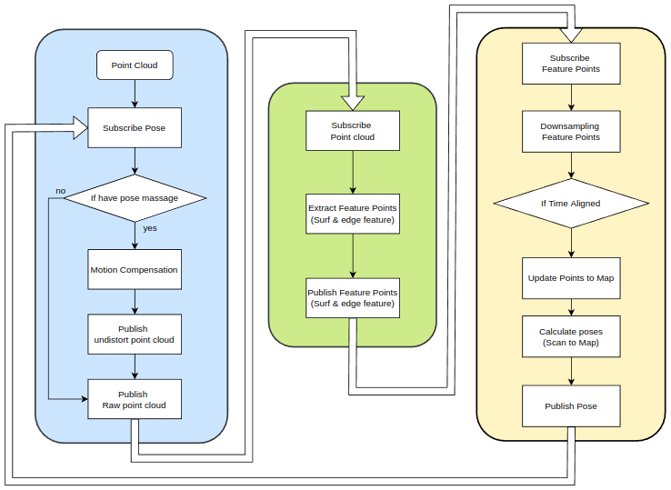


## 4.1 一般点云数据

### 4.1.1 原始点云：


### 4.1.2 运动补偿后：


## 4.2 带ROI区域的点云数据

### 4.2.1 原始点云:


### 4.2.2 运动补偿后：

> 使用去畸变后的带有ROI区域的点云进行位姿估计会有抖动，表现在yaw角和水平方向抖动。


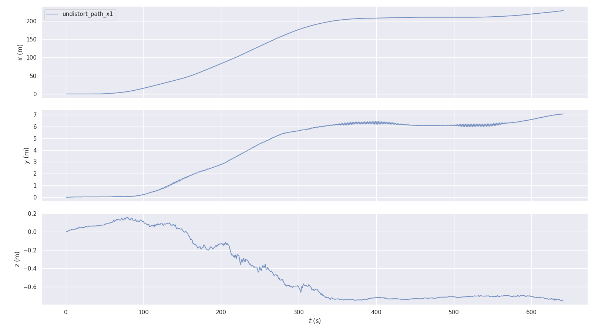


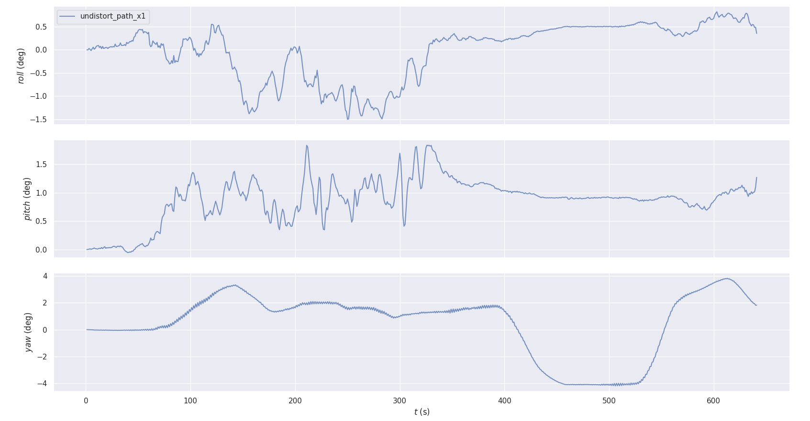


> 使用未去畸变的带ROI区域的点云的直接进行位姿估计，使用估计的位姿补偿点云效果正常。


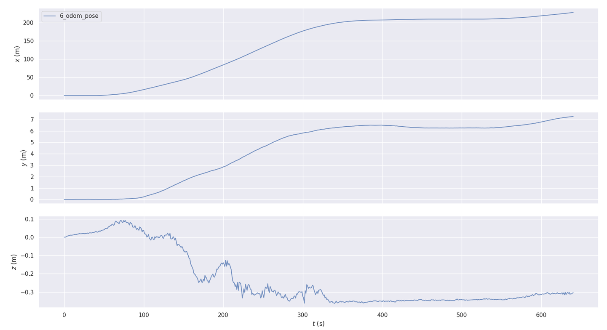


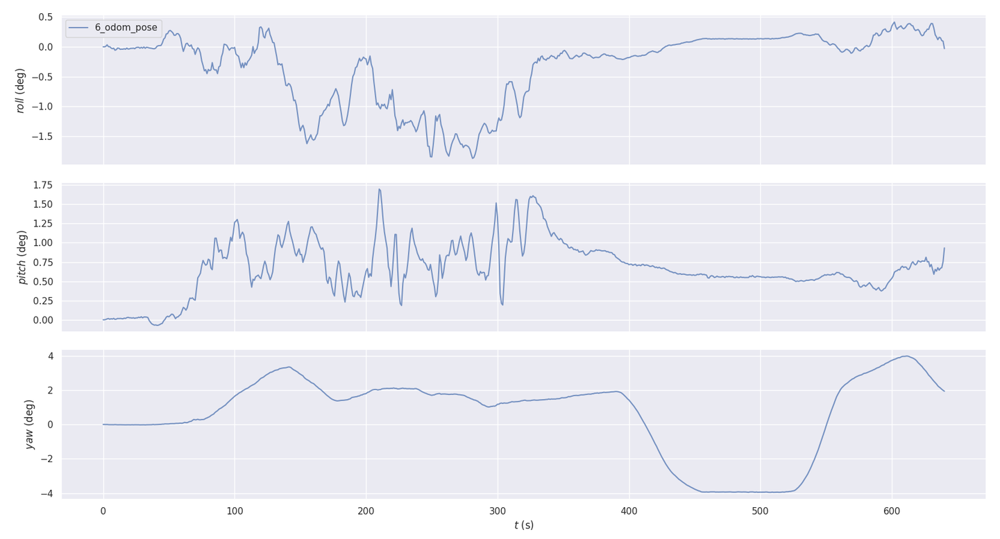


## 4.3 使用里程计补偿与IMU数据补偿对比
| case0 | case 1 | case 2 | case 3 |
|:-----:|:-----:|:-----:|:-----:|
| IMU pose traj(As benchmark) | Lidar Odometry | Lidar Odometry with motion compensation(use lidar pose) | Lidar Odometry with motion compensation(use IMU pose)|

    MOTION COMPENSATION TIME COST：10～11ms

1. Traj Compare

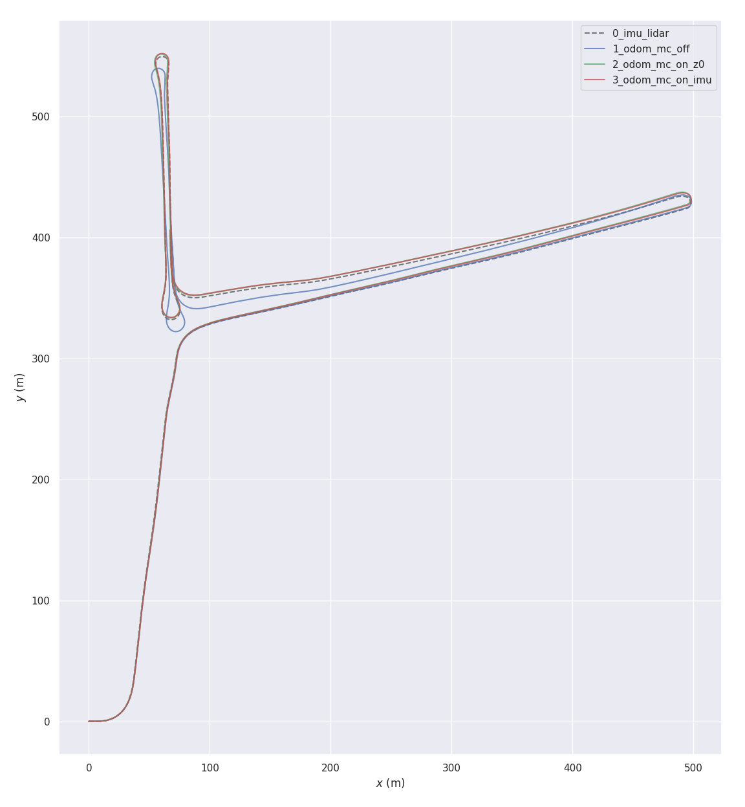
{: width="972" height="589" }

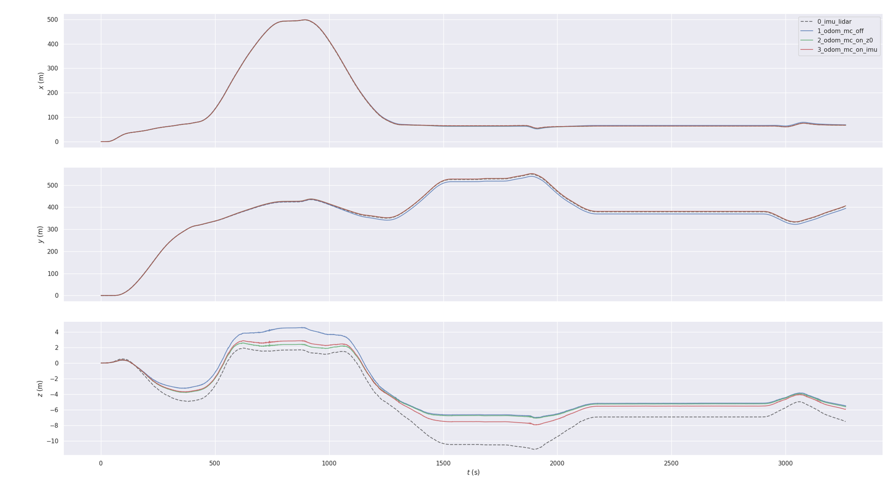


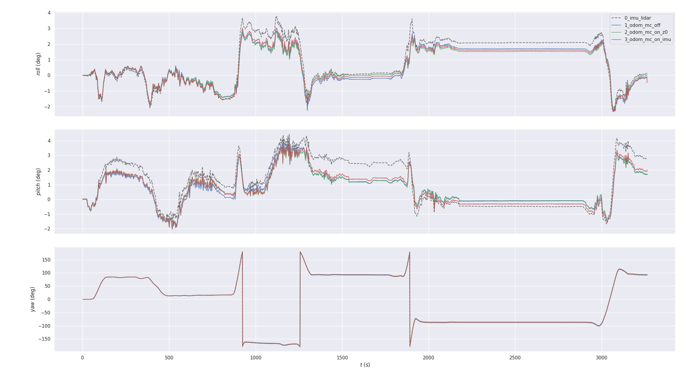


1. APE/RPE Compare

_case 1  Lidar Odometry_

_case 2  Lidar Odometry with motion compensation(use lidar pose)_

_case 3  Lidar Odometry with motion compensation(use IMU pose)_

APE

max: 10.616702   

mean: 3.737836 

median: 2.983362    

min: 1.440695   

rmse: 4.288223    

sse: 60002.828478    

std: 2.101770

max: 2.547730   

mean: 0.969200 

median: 0.744184    

min: 0.291779   

rmse: 1.150269   

sse:4317.335492   

std: 0.619491

max: 2.837380

mean: 0.994429

median: 0.685036

min: 0.215689

rmse: 1.203610

sse: 4727.029925

std: 0.678076

RPE

max: 0.185982   

mean: 0.046627 

median: 0.041351    

min: 0.000653   

rmse: 0.060585    

sse: 11.973356    

std: 0.038684

max: 0.270876   

mean: 0.045510 

median: 0.034780    

min: 0.002567   

rmse: 0.056913    

sse: 10.566057    

std: 0.034176

max: 0.219818   

mean: 0.020489

median: 0.016376    

min: 0.000290   

rmse: 0.027030    

sse: 2.383370    

std: 0.017630


# 5. Instruction of Undistortion ROS Tool

 

function

INPUT:
  rosbag
  
output:
  pcd or rosbag